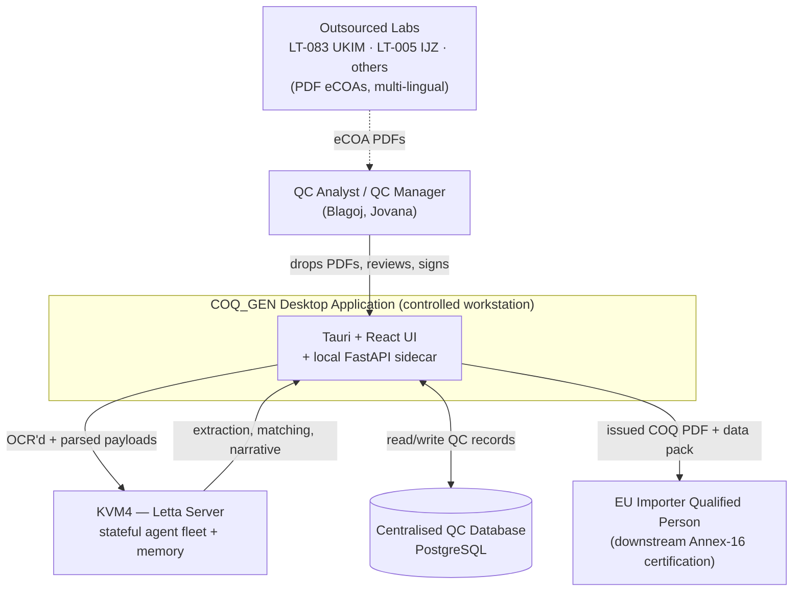
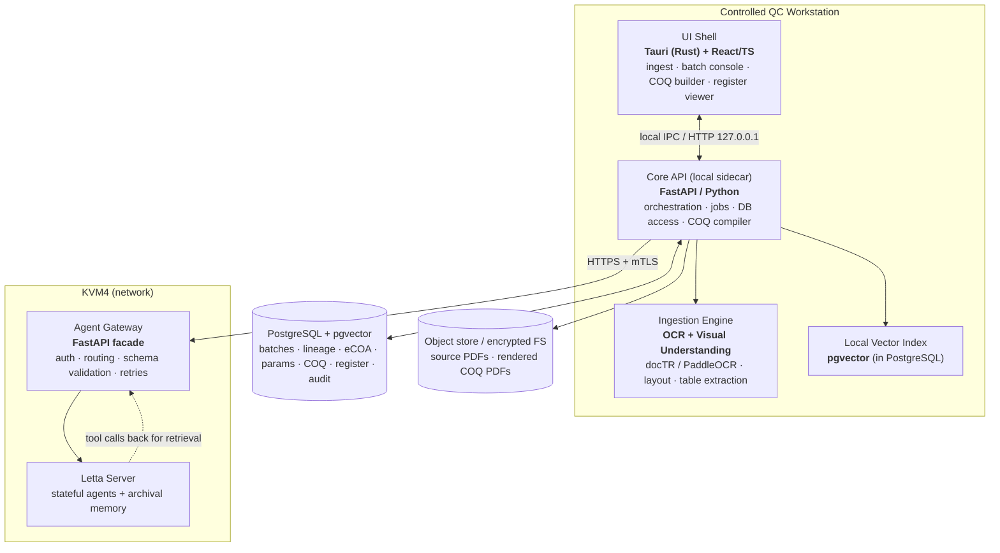
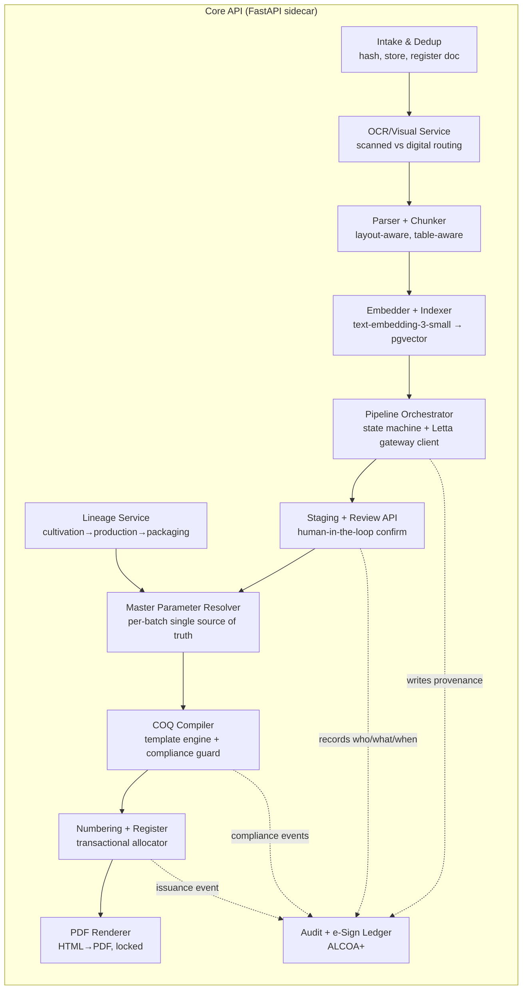
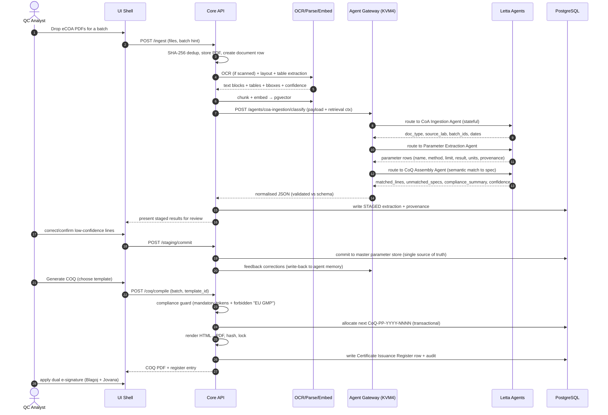
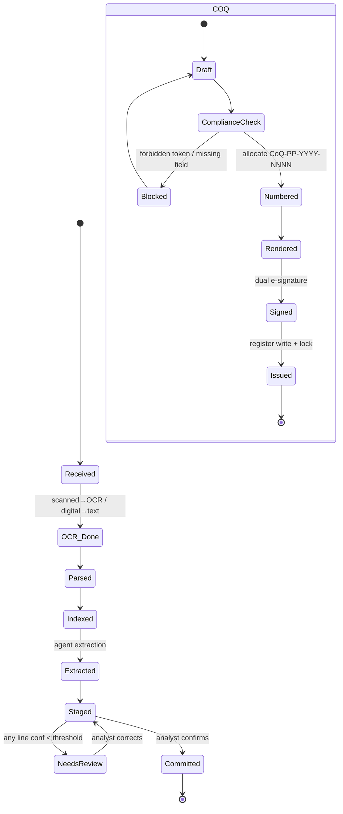
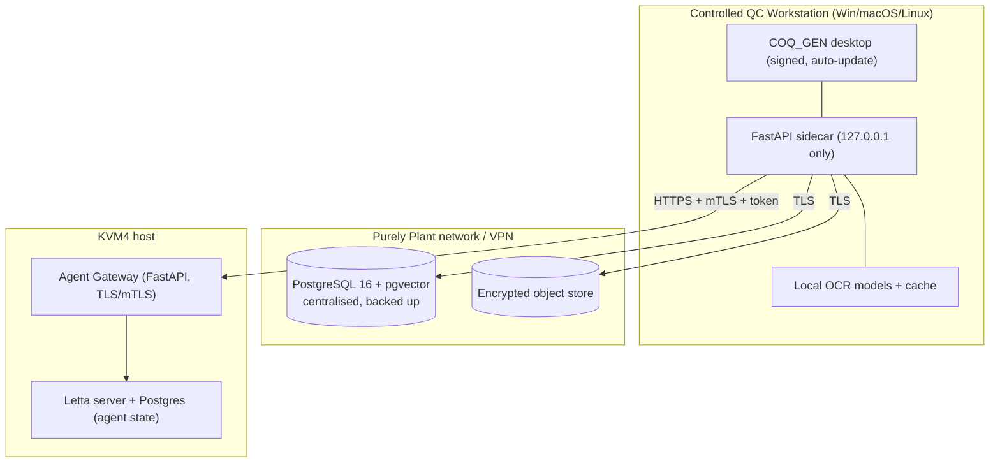

# 01 — Software Architecture

This document describes COQ_GEN using the **C4 model** (Context → Container → Component) plus the
key runtime flows. The guiding principles are stated first because they explain every later
decision.

## 1.1 Architectural principles

1. **Deterministic core, agentic edge.** Anything that touches a released certificate (numbering,
   register, template rendering, PDF bytes, audit) is deterministic and testable. The *judgement*
   (extraction, semantic matching, narrative) is delegated to Letta agents and is always
   **human‑confirmable** before it can influence a release.
2. **Provenance is not optional.** No value enters the master parameter store without a pointer to
   its source (eCOA id → page → bounding box → confidence → asserting model). The COQ cannot render
   a line that lacks provenance.
3. **The database is the contract.** The relational schema ([03](03_DATA_MODEL.md)) is the single
   source of truth; agents and UI are clients of it. Agent output is *staged*, reviewed, then
   *committed* — agents never write directly to release tables.
4. **Local‑first, KVM4‑augmented.** The desktop app and its local FastAPI sidecar own the data,
   the DB connection, the OCR, and the COQ compiler. KVM4 (Letta) provides intelligence and
   cross‑batch memory. A KVM4 outage degrades the app to "manual assist", never to "data loss".
5. **Templates are user data.** COQ layouts are uploaded HTML (Variation F family), validated
   against a mandatory‑token contract, version‑controlled, and rendered in a sandbox.

## 1.2 C4 Level 1 — System context

## 1.3 C4 Level 2 — Containers

**Container responsibilities**

| Container | Responsibility | Tech |
|-----------|----------------|------|
| **UI Shell** | All human interaction; native file handling; renders staged extractions for review; drives the COQ builder; never talks to KVM4 directly. | Tauri (Rust) + React + TypeScript |
| **Core API (sidecar)** | The brain on the workstation: job queue, pipeline state machine, DB access, COQ compiler, audit writer, Letta gateway client. Runs as a localhost‑only FastAPI process started by the Tauri shell. | FastAPI, SQLAlchemy, Alembic, Celery/RQ or asyncio jobs |
| **Ingestion Engine** | OCR, layout analysis, table extraction, PDF text extraction, image preprocessing. Pure functions, no agent dependency. | docTR / PaddleOCR / Tesseract; pdfplumber/PyMuPDF; OpenCV |
| **Agent Gateway** | The *only* surface the app uses to reach Letta. Validates request/response schemas, enforces auth, applies retries/timeouts/circuit‑breaking, normalises agent JSON. | FastAPI on KVM4 |
| **Letta Server** | Hosts the stateful agent fleet + per‑agent archival memory; performs RAAG. | Letta on KVM4 |
| **PostgreSQL + pgvector** | Centralised relational store **and** the embedding index. One database = one transactional truth + simple backup/restore for CSV. | PostgreSQL 16 + pgvector |
| **Object store** | Immutable source PDFs and rendered COQ PDFs, content‑addressed (SHA‑256). | Encrypted local FS or MinIO/S3 |

## 1.4 C4 Level 3 — Core API components

## 1.5 Primary runtime flow — eCOA → COQ (sequence)

## 1.6 Pipeline state machine

Each ingested document and each batch‑COQ moves through explicit states; the orchestrator is the
only writer of these transitions and every transition is audited.

## 1.7 Failure & degradation modes

| Failure | Behaviour |
|---------|-----------|
| KVM4 / Letta unreachable | Ingestion still runs (OCR/parse/embed local). Extraction queues; analyst can also enter parameters manually. COQ engine fully functional on already‑committed data. |
| Agent returns malformed JSON | Gateway rejects against JSON Schema; Core API marks line `extraction_failed`, never stages garbage; retried with stricter prompt; falls back to manual. |
| OCR low confidence | Page flagged; routed to `warehouse_quarantine_ocr_agent` (gpt‑4o) as a second pass; analyst sees the original page region side‑by‑side. |
| Numbering race (two COQs at once) | `SELECT … FOR UPDATE` on the per‑year counter row inside the issuing transaction guarantees monotonicity. |
| Template renders a forbidden string | Compliance guard *blocks* issuance, shows the offending token + location, requires owner override (recorded). |
| DB connection lost mid‑issue | Issuance is a single transaction (allocate number + register row + lock); it either fully commits or fully rolls back — no orphan numbers. |

## 1.8 Deployment topology

- The desktop app is **code‑signed** and **auto‑updates**; the sidecar binds to `127.0.0.1`
  only and is never exposed on the network.
- The **centralised** PostgreSQL satisfies the brief's "centralised relational database"
  requirement — all workstations share one transactional truth, enabling multi‑analyst use and a
  single backup/restore boundary for Computer System Validation.
- KVM4 holds only *agent* state (memory, learned synonyms); the *records of truth* live in the
  Purely Plant database, keeping the regulated data inside the controlled boundary.

See [02 — Technology Stack](02_TECH_STACK.md) for the concrete component choices and rationale.
