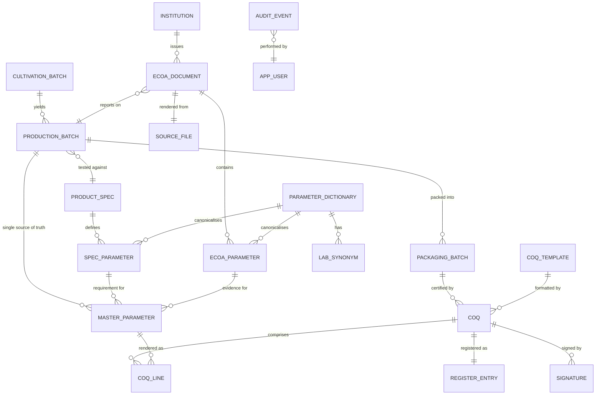
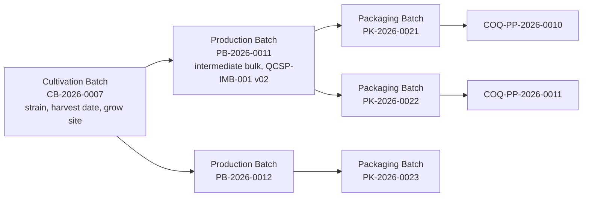

# 03 — Data Model, Lineage & Traceability

The database is the contract. This document defines the relational model that satisfies four
brief requirements simultaneously:

1. Track/store **all eCOA data**, indexed by **Batch Number** and **Packaging Batch Number**.
2. **Lineage**: Cultivation Batch № → Production Batch № → Packaging Batch №.
3. A per‑batch **master parameter database** = single source of truth for COQ compilation.
4. Every COQ result line maps back to its **source eCOA document code + date**.

The executable DDL is [db/schema.sql](../db/schema.sql); this document explains the *why*.

## 3.1 Entity‑relationship overview



## 3.2 Lineage model (cultivation → production → packaging)

Cannabis traceability is inherently a **tree that converges and diverges**: a cultivation batch
(a harvest lot of a strain) feeds one or more production batches (drying/curing/processing into
intermediate bulk), each of which is split into packaging batches (the units that ship). The
COQ is issued at the **packaging** level, but the analytical testing usually happens at the
**production (intermediate bulk)** level, and identity/strain provenance comes from the
**cultivation** level.



Design choices:

- Lineage links are **first‑class rows** (`cultivation_batch`, `production_batch`,
  `packaging_batch` with FKs), not free‑text fields, so a query can walk from any packaging
  batch back to its harvest, and forward from a harvest to every certificate it ever produced.
- The links are **many‑to‑one upward** (a packaging batch belongs to exactly one production
  batch; a production batch to exactly one cultivation batch) which matches the real physical
  process and keeps lineage queries simple recursive CTEs.
- Each level carries the identifiers the COQ and the EU QP need: strain, harvest/production/
  packaging dates, quantities, site, and the spec the production batch was tested against.

## 3.3 eCOA storage — indexed by batch & packaging batch

`ecoa_document` is the unit of ingestion. It is **immutable once committed** and content‑addressed
to its `source_file` (SHA‑256), so the exact bytes a value was read from can always be reproduced.

Key columns:

- `document_code` — the eCOA's own identifier (lab report number **or** `eCoA-PP-YYYY-NNNN`).
- `institution_id` → `institution` (name, address, accreditation, lab code `LT-083`/`LT-005`).
- `production_batch_id` and a denormalised `batch_number` + `packaging_batch_number` (the brief's
  required indexes — both are explicitly indexed columns for the analyst's primary lookup).
- `issue_date`, `analysis_date`, `sampling_date`.
- `language`, `doc_type` (`cannabis_coa`, `water_quality`, `other`), `extraction_confidence`.

`ecoa_parameter` is one row **per analytical line per eCOA**, carrying the full record from
[00 §0.5] plus provenance (`page`, `bbox`, `confidence`, `asserted_by_agent`, `asserted_by_model`,
`raw_text`). This table is **append‑style + staged**: agent output lands as `status = 'staged'`;
an analyst's confirmation flips it to `committed`; corrections write a new version and supersede
the old (never destructive — ALCOA+ "Original" + "Enduring").

## 3.4 The parameter dictionary (how heterogeneous, multilingual labs reconcile)

This is the heart of the "multiple institutions, different parameters, different languages"
requirement. Three tables:

- `parameter_dictionary` — the **canonical ontology**: one row per real‑world parameter, e.g.
  *Total Aerobic Microbial Count* (`canonical_key = TAMC`), with canonical unit, category
  (microbiology / heavy_metals / pesticides / mycotoxins / cannabinoids / water_activity / …),
  and the default pharmacopoeial method family.
- `lab_synonym` — every way a lab writes that parameter, with language and lab code. Example rows:

  | canonical | lab | language | printed_term |
  |-----------|-----|----------|--------------|
  | TAMC | LT-083 UKIM | en | `TAMC` |
  | TAMC | LT-005 IJZ | mk | `Вкупен број на аеробни микроорганизми` |
  | TAMC | (generic) | en | `Total Aerobic Microbial Count` |

- `spec_parameter` and `ecoa_parameter` both carry a nullable `canonical_key` FK. Matching is the
  act of populating it: the agent proposes the canonical key (semantic, cross‑lingual); the
  analyst confirms; the confirmed mapping is **written back** as a new `lab_synonym` row so the
  next document from that lab matches deterministically. This is the learning loop of RAAG made
  durable in the relational store (mirrored in the agent's archival memory).

## 3.5 The master parameter store — single source of truth

`master_parameter` is the reconciled, per‑(production)‑batch table the COQ is compiled from.
One row per **spec requirement** for the batch, resolved to the **best available evidence**:

```
master_parameter
├── production_batch_id        → which batch
├── spec_parameter_id          → the requirement (name, limit, method from the active spec)
├── canonical_key              → the canonical parameter
├── selected_ecoa_parameter_id → the chosen eCOA result line (the evidence)
├── result_value, result_unit, result_qualifier
├── verdict                    → pass | fail | pending | not_tested
├── source_institution_id      → which lab produced the evidence
├── source_document_code       → eCOA code  ┐ these two are the brief's
├── source_document_date       → eCOA date  ┘ "map back to source" requirement
├── confidence, selection_reason
└── status                     → draft | confirmed | superseded
```

Why a materialised store rather than a view:

- **Stability.** A COQ must certify a *frozen* set of results. Once `confirmed`, the master row
  is the immutable basis of any COQ that cites it; later eCOAs create *new* versions, leaving the
  issued COQ's evidence intact.
- **Conflict resolution.** When two labs report the same parameter, the resolver records *which*
  was chosen and *why* (`selection_reason`) — auditable judgement, not a hidden `MAX()`.
- **Gap visibility.** Spec requirements with no evidence are present as rows with
  `verdict = 'not_tested'`, so the COQ engine and the analyst see gaps explicitly (the brief's
  "flag spec parameters with no matching eCOA result").

The resolver algorithm (priority): (1) confirmed match for this batch & canonical key; (2)
highest‑confidence committed eCOA parameter whose method satisfies the spec's method family; (3)
analyst override always wins and is recorded. Ambiguity (>1 candidate, none confirmed) is surfaced
for human selection, never auto‑resolved silently.

## 3.6 COQ, lines, register, signatures

- `coq` — one row per issued (or draft) certificate: `coq_number` (`CoQ-PP-YYYY-NNNN`),
  `packaging_batch_id`, `spec_reference`, `template_id`, `status`, `pdf_sha256`, dates,
  disposition.
- `coq_line` — a **snapshot copy** of each `master_parameter` at issue time (value, unit, verdict,
  limit, method, **source document code + date**, institution). Snapshotting (not FK‑only) means a
  reissued spec or a superseded master row can never silently change what a *signed* COQ says.
- `register_entry` — the QCLB 020 / Annex A05 row (see [06 §6.6]), 1:1 with `coq`.
- `coq_sequence` — the per‑year monotonic counter (`year`, `last_value`), updated under
  `SELECT … FOR UPDATE` inside the issuing transaction → guaranteed no gaps/dupes (QCSOP 012 v3).
- `signature` — the e‑signature ledger: who, role, meaning ("Prepared & Approved" / "Reviewed"),
  timestamp, method, and the `record_sha256` the signature is bound to (Annex 11 §14).

## 3.7 Controlled vocabulary & configuration (no magic strings)

`controlled_vocabulary` and `app_config` hold the *editable* business rules so procedures can
evolve without code changes and every change is itself audited:

- forbidden output strings per document class (e.g., `EU GMP` forbidden on `flower_coq`);
- GMP facility wording (`MK GMP Certified Facility`, MALMED, N. Macedonia);
- signatory roster + required signature roles/count;
- numbering format + current counters;
- mandatory COQ token set (the EU‑GMP information completeness list).

## 3.8 Audit trail

`audit_event` is an append‑only, hash‑chained log: `(prev_hash, payload, payload_hash)` where
`payload_hash = SHA256(prev_hash || canonical_json(payload))`. Any record mutation, staging
commit, numbering allocation, compliance block/override, render, signature and export emits an
event. The chain makes silent back‑dating or deletion detectable — the data‑integrity backbone
detailed in [08](08_SECURITY_DATA_INTEGRITY.md).

## 3.9 Indexing summary (the brief's required lookups)

| Lookup | Index |
|--------|-------|
| by Batch Number | `idx_ecoa_batch_number`, `idx_master_batch`, `idx_coq_batch` |
| by Packaging Batch Number | `idx_ecoa_pkg_batch`, `idx_coq_pkg_batch` |
| lineage walk | FK indexes on `production_batch.cultivation_batch_id`, `packaging_batch.production_batch_id` |
| semantic retrieval | `ivfflat`/`hnsw` index on `ecoa_chunk.embedding` (pgvector) |
| register / numbering | `uq_coq_number`, `uq_register_seq_per_year` |

See the full DDL in [db/schema.sql](../db/schema.sql).
