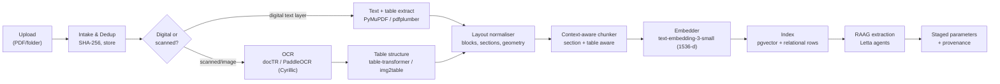

# 04 — Ingestion, OCR/Visual Understanding & the RAAG Pipeline

This document specifies the deterministic data‑engineering half of the system: how a raw eCOA PDF
becomes structured, provenance‑bearing, retrievable data — and how that data is handed to the
agentic (RAAG) layer for extraction and matching.

## 4.1 Pipeline stages



## 4.2 Intake & deduplication

- Every uploaded file is hashed (SHA‑256). The hash is the `source_file` content address: a
  re‑uploaded identical PDF is recognised, never double‑ingested, and any extracted value can be
  traced to *exact bytes* (ALCOA+ "Original").
- A batch hint is captured from the analyst (which production/packaging batch this belongs to),
  but the agents also detect batch identifiers from the document itself and reconcile — a
  mismatch is flagged rather than silently trusted.

## 4.3 Digital‑vs‑scanned routing

A text‑layer probe (`PyMuPDF`: ratio of extractable characters to page area) classifies each
page:

- **Digital** → `pdfplumber` / PyMuPDF extract text *with coordinates* and tables *with cell
  geometry*. Lossless and fast; no OCR error introduced.
- **Scanned / image** → OCR. This is the common case for outsourced labs that print, stamp, sign
  and re‑scan.

Mixed documents are handled page‑by‑page (e.g., a digital report with a scanned, signed last
page).

## 4.4 OCR + visual understanding

- **Engines, in order:** `docTR` (DL detection+recognition, layout‑aware) → `PaddleOCR`
  (selected explicitly for **Cyrillic** — `LT-005 IJZ` issues Macedonian‑language certificates)
  → `Tesseract` (deterministic fallback). The vision‑capable `warehouse_quarantine_ocr_agent`
  (gpt‑4o) is the escalation for degraded scans where local OCR confidence is low.
- **Preprocessing:** deskew, denoise, adaptive binarisation, DPI normalisation (OpenCV) before
  OCR to lift recognition on stamped/scanned pages.
- **Table recovery:** lab results are tables; `table-transformer`/`img2table` recover row/column
  structure so a *result value stays bound to its parameter row and its acceptance‑criteria
  column*. Losing table structure is the single biggest risk to extraction accuracy, so it is a
  dedicated stage with its own confidence metric.
- **Provenance capture:** every recognised token carries `{page, bbox, confidence}`. These flow
  all the way to `ecoa_parameter.bbox` so the UI can highlight the exact region a value came from.

## 4.5 Context‑aware parsing & chunking

Naïve fixed‑size chunking destroys the meaning of a certificate. The chunker is **structure
aware**:

- **Section segmentation** first: header (lab identity, dates, sample id), methods, the
  results table(s), signatures, footer. Sections are tagged on `ecoa_chunk.section`.
- **Table‑row chunks:** each results row becomes (a) a structured candidate `ecoa_parameter` and
  (b) a natural‑language chunk ("Parameter X, method Y, limit Z, result R, unit U") so semantic
  retrieval works even when a lab's layout is unusual.
- **Header/credential chunks:** institution name, address, accreditation, and the document code +
  dates are isolated so the ingestion agent can extract issuing‑institution metadata reliably.
- Chunk size targets the agents' embedding configuration (`embedding_chunk_size = 300`) so the
  app's vectors are *interoperable* with Letta archival memory.

## 4.6 Embedding & indexing

- **Model: `text-embedding-3-small` (1536‑d)** — deliberately identical to every KVM4 agent's
  `embedding_config`, so a chunk embedded by the app can be searched by a Letta agent and vice
  versa, with no re‑embedding.
- Embeddings are written to `ecoa_chunk.embedding` (pgvector, HNSW cosine index). Because vectors
  live in the same PostgreSQL as the records, retrieval can combine **semantic similarity** with
  **hard relational filters** in one query, e.g.:

  ```sql
  SELECT c.content, c.page, c.bbox
  FROM ecoa_chunk c
  JOIN ecoa_document d ON d.id = c.ecoa_document_id
  WHERE d.production_batch_id = :batch
    AND c.section = 'results_table'
  ORDER BY c.embedding <=> :query_embedding
  LIMIT 12;
  ```

## 4.7 RAAG — the agentic extraction & matching layer

This is where deterministic data engineering hands off to **Retrieval‑Augmented Agentic
Generation** (defined in [00 §0.7]). The Core API calls the FastAPI gateway, which routes to the
stateful Letta agents. Each agent both *receives* app‑prepared context and *pulls more on its own*
via Letta's retrieval tools (`archival_memory_search`, `semantic_search_files`, `grep_files`,
`conversation_search`).

```mermaid
sequenceDiagram
    autonumber
    participant C as Core API
    participant G as Gateway (KVM4)
    participant ING as CoA Ingestion Agent
    participant EXT as Parameter Extraction Agent
    participant ASM as CoQ Assembly Agent
    participant MEM as Letta archival memory

    C->>G: classify(document payload + top-k chunks)
    G->>ING: doc payload
    ING->>MEM: recall lab extraction patterns
    ING-->>G: doc_type, source_lab, batch_ids, dates, confidence
    G->>EXT: extract(parameters)
    EXT->>MEM: recall lab parameter-naming patterns
    EXT-->>G: parameter rows + provenance + confidence
    G->>ASM: match(parameters -> active spec)
    ASM->>MEM: recall synonyms, prior corrections, register state
    ASM-->>G: matched_lines, unmatched_specs, summary, confidence
    G-->>C: validated JSON (per schema)
    C->>C: stage rows; flag conf < threshold for review
```

Key RAAG behaviours:

1. **Cross‑lingual semantic matching, not string matching.** The assembly agent maps
   `TAMC` (UKIM, en) and `Вкупен број на аеробни микроорганизми` (IJZ, mk) to the same canonical
   parameter using meaning + learned synonyms — exactly the heterogeneity the brief calls out.
2. **Confidence‑gated retrieval.** A low‑confidence line triggers *more* retrieval (more chunks,
   the lab's synonym history, similar past batches) before the agent commits to an answer.
3. **Durable learning loop.** When an analyst corrects a mapping, the correction is written to
   **both** the relational `lab_synonym` table **and** the agent's archival memory (via the
   gateway → `letta_memory_unified.create_passage`), so the next document from that lab matches
   deterministically and the agent's behaviour improves measurably per lab.

## 4.8 Heterogeneous, multi‑institution assembly

A single production batch's spec is typically satisfied by **several** eCOAs from **different**
institutions (microbiology from one lab, heavy metals from another, potency from a third). The
pipeline treats each eCOA independently through extraction, then the **master parameter resolver**
([03 §3.5]) reconciles across documents into one per‑batch truth, recording which lab/eCOA
supplied each parameter and why. This is the structural answer to "multiple institutions may
provide results for different parameters within a single product specification."

## 4.9 Quality gates & thresholds (configurable)

| Gate | Default | Action on failure |
|------|---------|-------------------|
| OCR page confidence | < 0.80 | escalate to gpt‑4o OCR agent; flag page for human view |
| Field extraction confidence | < 0.85 | line enters `NeedsReview`; cannot auto‑commit |
| Spec match confidence | < 0.90 | mapping requires explicit analyst confirmation |
| Batch‑id reconciliation | mismatch | block staging; surface conflict to analyst |
| Date sanity (analysis ≥ sampling, issue ≥ analysis) | violated | flag for review |

All thresholds live in `app_config`, are environment‑scoped, and changes are audited.

## 4.10 Outputs of this layer

- `ecoa_document`, `ecoa_parameter` (staged), `ecoa_chunk` (+embeddings) rows.
- A staged‑review payload for the UI (parameters + provenance + confidences + proposed canonical
  matches), which the analyst confirms to populate the **master parameter store** that the
  [COQ engine](06_COQ_GENERATION_ENGINE.md) compiles from.

The agents that power this layer, and the gateway contract, are specified next in
[05 — Letta Agent Integration](05_LETTA_AGENT_INTEGRATION.md).
