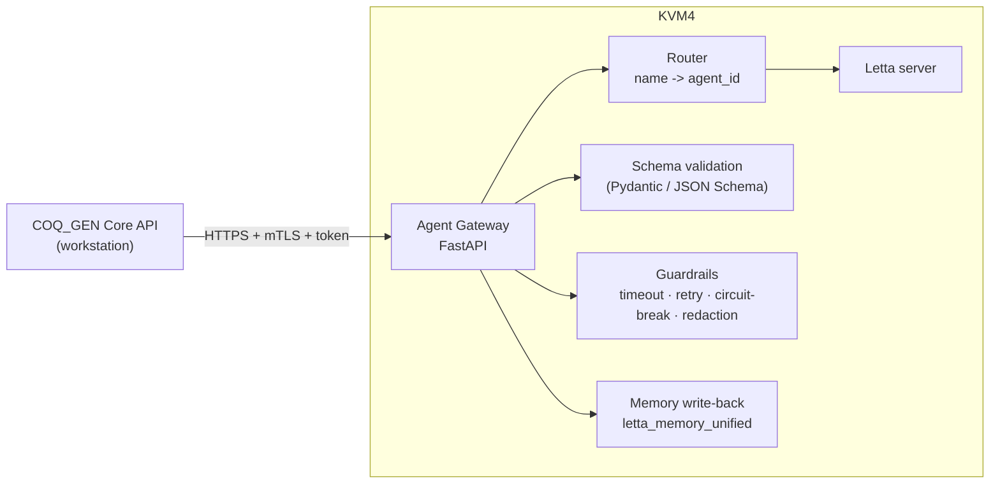

# 05 — Letta Agent Integration (FastAPI gateway on KVM4)

The brief requires: *"Integrate with dedicated Letta stateful AI agents via FastAPI hosted on
KVM4."* This document specifies the agent fleet (which already exists), the gateway that fronts
it, the request/response contracts, and the memory/learning model.

## 5.1 The deployed agent fleet (KVM4)

These agents are **already provisioned** on the Letta server and form the orchestration backbone.
COQ_GEN consumes them; it does not reinvent them. (IDs are stable references the gateway routes to.)

| Agent | Model | Stage | Output the app consumes |
|-------|-------|-------|-------------------------|
| **CoA Ingestion Agent** | deepseek‑v4‑flash | classify | `doc_type, source_lab, batch_numbers, strain_names, dates, page_count, extraction_confidence` |
| **Parameter Extraction Agent** | deepseek‑v4‑flash | extract | parameter rows: name, method, acceptance, result, unit, provenance |
| **CoQ Assembly Agent** | deepseek‑v4‑pro | match + number | `coq_number, matched_lines[], unmatched_specs[], compliance_summary, confidence_score, register_entry` |
| **Compliance Analysis Agent** | deepseek‑v4‑pro | assess | per‑parameter pass/fail, OOS detection, risk notes |
| **Specification Advisor Agent** | deepseek‑v4‑pro | spec | active spec + version recommendation, parameter applicability |
| **Report Generation Agent** | deepseek‑v4‑pro | narrate | compliance narrative / summary text |
| **Search Assistant Agent** | deepseek‑v4‑flash | retrieve | cross‑document semantic answers |
| **ecoa-qc-agent** | deepseek‑v4‑pro | QC | sanity/consistency checks on eCOA data |
| **warehouse_quarantine_ocr_agent** | gpt‑4o (vision) | OCR escalation | text from degraded scans |
| **VariationF** | gpt‑4o | templating/rules | Variation F design system, **locked business rules**, GMP wording guardrails |

A small **pp_annex_*** family (orchestrator, translator, body_formatter, table_specialist,
auditor) exists for regulated‑document formatting and is available to the COQ rendering path when
multilingual annex formatting is needed.

## 5.1a Reuse principle & agent suitability (selection, not recreation)

**Design rule (per project direction): COQ_GEN reuses the agents already deployed on KVM4 via the
FastAPI gateway and creates no new agents unless a genuine capability gap is proven. Only
*suitable* agents are wired into the pipeline.** The Letta server hosts 42 agents; most belong to
other initiatives and must **not** be invoked by COQ_GEN. The gateway's route map is the
allow‑list that enforces this — an agent absent from the map is unreachable from the app.

**Utilised (suitable) — wired into the route map:**

| Agent | Why it is suitable |
|-------|--------------------|
| `CoA Ingestion Agent` | Core: doc‑type detection, OCR coordination, classification, batch/date metadata |
| `Parameter Extraction Agent` | Core: structured parameter extraction |
| `CoQ Assembly Agent` | Core: semantic spec matching, numbering proposal, register, narrative |
| `Compliance Analysis Agent` | Core: per‑parameter pass/fail + OOS detection |
| `Specification Advisor Agent` | Spec selection/version applicability |
| `Report Generation Agent` | Compliance narrative composition |
| `Search Assistant Agent` | Cross‑document semantic retrieval (RAAG) |
| `ecoa-qc-agent` | eCOA consistency/sanity QC |
| `imb_qc_coa_agent` | Intermediate‑bulk (IMB) QC CoA — directly on‑scope for `QCSP-IMB-001` |
| `warehouse_quarantine_ocr_agent` | gpt‑4o vision OCR escalation for degraded scans |
| `VariationF` | Design‑system + locked business rules / GMP wording authority |
| `pp_annex_translator` | MK↔EN translation for Cyrillic (`LT-005 IJZ`) certificates |
| `pp_annex_table_specialist` | Hard table‑structure recovery on complex result tables |
| `pp_annex_orchestrator`, `pp_annex_body_formatter`, `pp_annex_auditor` | Multilingual regulated‑annex formatting (COQ render path, when needed) |

**Conditional (enable per document class):**

| Agent | Condition |
|-------|-----------|
| `pq1_water_qc_agent` | Only when the ingested document is a **water quality report** (`doc_type = water_quality`), not on flower COQ assembly |

**Excluded (not suitable — must NOT be called by COQ_GEN):**
`stock_trading_advisor`, `trend_detector`, `executive_summarizer`, `weekly_report_analyst`,
`ars_pipeline_orchestrator`, `ars_collaboration_depth`, `ars_field_analyst`,
`equipment_manuals_agent` — these belong to unrelated initiatives. They are deliberately omitted
from the gateway route map, so the app cannot reach them even by mistake.

**Capability‑gap policy:** if a needed capability is missing, prefer (1) attaching a tool to an
existing suitable agent (`letta_tool_manager`) or (2) extending its memory/prompt under change
control, over creating a brand‑new agent. New agents are a last resort and go through the staging
org + validation in §5.6.

> Authoritative agent rules already encoded (verified from the live agents):
> the **CoQ Assembly Agent** holds QCSOP 012 v3 numbering, QCSOP 010 spec coding, the QCLB 020
> register field set, the LT‑083/LT‑005 lab synonym knowledge, and the strict JSON output schema.
> **VariationF** holds the Navy & Gold palette, the *"MK GMP, never EU GMP"* wording rule, the
> two‑signatory/no‑QP rule, and the template inventory. COQ_GEN treats these as the source of
> business truth and mirrors them into `controlled_vocabulary`/`app_config` for deterministic,
> offline‑capable enforcement.

## 5.2 Why a FastAPI gateway (and not the app calling Letta directly)



The gateway is the **single, validated seam** between the regulated app and the probabilistic
agents:

1. **Schema enforcement.** Agent JSON is validated against versioned JSON Schemas *before* it can
   reach the database. Malformed output is rejected, retried with a stricter prompt, and never
   staged. (The CoQ Assembly Agent already returns a strict JSON contract — the gateway makes that
   contract *enforced*, not merely requested.)
2. **Routing + versioning.** The app calls stable logical endpoints
   (`/agents/coa-ingestion/classify`); the gateway maps them to concrete `agent-…` IDs and pins
   model/agent versions, so an agent can be upgraded on KVM4 without changing the app.
3. **Resilience.** Timeouts, bounded retries with backoff, and a circuit breaker isolate the app
   from KVM4 latency/outage (degrades to manual assist, per [01 §1.7]).
4. **Security & data minimisation.** mTLS + bearer token; the gateway redacts/limits what leaves
   the controlled boundary (it sends *chunks and structured candidates*, not whole patient‑style
   PII), and it is the only audited egress point.
5. **Memory write‑back.** Analyst corrections flow back through the gateway to the right agent's
   archival memory, closing the RAAG learning loop centrally and audibly.

The full contract is in [api/gateway_openapi.yaml](../api/gateway_openapi.yaml).

## 5.3 Orchestration model

The Core API runs a **pipeline state machine** ([01 §1.6]) and calls the gateway per stage. Two
orchestration styles are supported and chosen per task:

- **App‑orchestrated (default, deterministic).** The Core API sequences ingestion → extraction →
  matching, persisting staged results between calls. This keeps control, audit, and retries in the
  regulated app.
- **Agent‑orchestrated (for cross‑document reasoning).** For genuinely multi‑document, multi‑lab
  assembly, the gateway can dispatch to the assembly agent which itself uses Letta multi‑agent
  tools (`send_message_to_agent_and_wait_for_reply`, `send_message_to_agents_matching_tags`) to
  consult the compliance and spec‑advisor agents. The *final* result still returns through the
  gateway and is validated/staged identically.

## 5.4 Request/response contract (representative)

`POST /agents/coq-assembly/match` request:

```json
{
  "production_batch_id": "uuid",
  "spec_reference": "QCSP-IMB-001 v02",
  "ecoa_parameters": [
    {"ecoa_parameter_id": "uuid", "printed_param_name": "TAMC",
     "method": "Ph.Eur 2.6.12", "result_text": "1.2x10^2", "unit": "CFU/g",
     "source_lab": "LT-083", "source_document_code": "UKIM-2026-114",
     "source_document_date": "2026-05-30", "confidence": 0.97}
  ],
  "retrieval_context": { "synonyms": [...], "prior_corrections": [...] }
}
```

Validated response (mirrors the CoQ Assembly Agent's live JSON schema):

```json
{
  "coq_number": "CoQ-PP-2026-0010",
  "spec_reference": "QCSP-IMB-001 v02",
  "matched_lines": [
    {"spec_param_name": "Total Aerobic Microbial Count",
     "matched_param_name": "TAMC", "canonical_key": "TAMC",
     "result_value": "1.2x10^2", "unit": "CFU/g", "status": "pass",
     "confidence": 0.98, "source_lab": "LT-083",
     "source_ecoa": "UKIM-2026-114", "reasoning": "..."}
  ],
  "unmatched_specs": ["Aflatoxins (sum B1,B2,G1,G2)"],
  "compliance_summary": "All tested parameters within QCSP-IMB-001 v02 limits ...",
  "confidence_score": 0.96,
  "register_entry": {
    "cert_type": "CoQ", "batch": "PB-2026-0011", "product_name": "...",
    "prepared_by": "Senior QC Analyst", "reviewed_by": "Head of QC"
  }
}
```

> **Numbering safety note.** The agent may *propose* a `coq_number` from its memory of the
> register, but the **authoritative** number is allocated by the Core API's transactional
> `coq_sequence` allocator at issue time ([03 §3.6], [06 §6.5]). The agent's proposal is treated as
> advisory and reconciled; the database is the source of truth for the monotonic sequence. After
> issue, the app writes the final number back to the agent's memory to keep them in sync.

## 5.5 Memory & learning model

Each agent's **archival memory** persists per‑lab knowledge across documents and sessions — this
is what makes them *stateful* (the brief's requirement) rather than stateless LLM calls. COQ_GEN
uses three memory surfaces via the Letta tools:

| Surface | Tool | Used for |
|---------|------|----------|
| Core memory blocks | `letta_memory_unified` (get/update_core_memory, blocks) | locked rules (VariationF: design_system, business_rules, repo_facts) |
| Archival passages | `letta_memory_unified` (create_passage, search_archival) | learned lab synonyms, prior corrections, OOS patterns, register history |
| Sources/files | `letta_source_manager`, `letta_file_folder_ops` | attaching reference specs/SOPs for `semantic_search_files`/`grep_files` |

Write‑back policy: a correction is committed to the **relational store first** (the record of
truth), then propagated to agent memory through the gateway. If the gateway/KVM4 is down, the
correction is queued and replayed — agent memory is eventually consistent with the database,
never the reverse.

## 5.6 Provisioning & operations (via Letta MCP)

During build and operations, the Letta MCP tool surface manages the fleet without bespoke code:

- `letta_agent_advanced` — create/clone/update agents, send/stream messages, inspect context.
- `letta_memory_unified` — read/write core blocks and archival passages.
- `letta_source_manager` / `letta_file_folder_ops` — attach the active spec set and SOPs.
- `letta_tool_manager` — register/attach tools (e.g., a future DB‑lookup tool for agents).
- `letta_job_monitor` — track long‑running async agent jobs.

A **staging Letta org** mirrors the production fleet for validation; agent prompt/version changes
are promoted through the same change‑control as code ([08](08_SECURITY_DATA_INTEGRITY.md)).

## 5.7 Configuration the gateway needs

| Setting | Example |
|---------|---------|
| `LETTA_BASE_URL` | KVM4 Letta endpoint |
| agent route map | `coa-ingestion → agent-ff02e492…`, `coq-assembly → agent-0b5ea789…`, `variation-f → agent-69047 27a…` |
| model pins | flash for extract/classify, pro for assembly/compliance, gpt‑4o for OCR/vision |
| timeouts/retries | per‑stage (extract 30s/2 retries; assembly 60s/2 retries) |
| schema versions | per endpoint, semver, validated on both request and response |

Everything that produces a *certificate* from this agent output is specified in
[06 — COQ Generation Engine](06_COQ_GENERATION_ENGINE.md).
