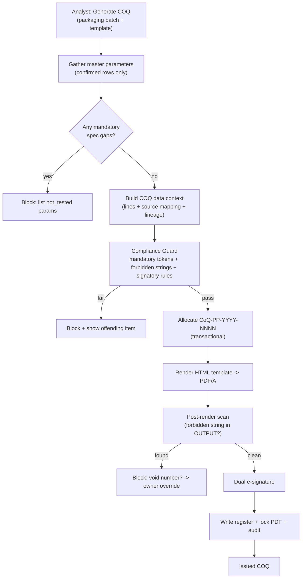

# 06 — COQ Generation Engine

The COQ engine turns the per‑batch **master parameter store** (the single source of truth) into a
signed, registered, exported Certificate of Quality, using a **user‑uploaded HTML template**,
while enforcing every Purely Plant business rule deterministically.

## 6.1 Engine overview



## 6.2 Inputs

- **Packaging batch** (the COQ is issued at packaging level) → resolves up the lineage to its
  production batch (analytical results) and cultivation batch (strain/identity).
- **Confirmed master parameters** for the production batch (status = `confirmed`).
- **A COQ template** (uploaded HTML, Variation F family) selected by the analyst.
- **Controlled vocabulary / config**: mandatory tokens, forbidden strings, GMP wording,
  signatory roster, numbering format.

## 6.3 Mandatory release information (the "EU‑GMP‑compliant content" set)

The engine refuses to render a COQ unless **every** mandatory field resolves. This is the
operational meaning of "EU‑GMP‑compliant": the certificate carries the complete information an EU
importer's Qualified Person needs for Annex‑16 batch certification.

| Group | Mandatory fields |
|-------|------------------|
| Identity | Product name, **dominance (THC/CBD) + grade tier**, **Batch Number**, **Packaging Batch Number**, lineage (cultivation/production), quantity. **Strain** is printed as *descriptive* plant information, not as a spec selector. |
| Conformance basis | The applicable **strain‑agnostic** product spec reference + version (`QCSP-IMB-001 v.01` or `QCSP-FP-001 v.01`); the THC assay verdict is evaluated against the batch's **grade** window from `spec_grade` |
| Specification | Spec reference + version (`QCSP-IMB-001 v02`), parameter list with limits |
| Results | For each parameter: name, **testing method**, acceptance criteria, result + unit + qualifier, **verdict** |
| Source mapping | For each result: **issuing institution** (name/address/credentials) + **source eCOA document code + date** |
| Dates | Sampling date, analysis date(s), COQ issue date |
| Disposition | Overall verdict (Released/Rejected/On‑hold) + compliance narrative; OOS reference if any |
| Manufacturer | **"MK GMP Certified Facility" (MALMED, N. Macedonia)** wording; manufacturer identity |
| Authorisation | **Two** signatories with roles + meaning + date (no QP on the manufacturer COQ) |
| Document control | COQ number (`CoQ-PP-YYYY-NNNN`), template name/version, page x/y |

The set is stored in `controlled_vocabulary(domain='mandatory_token')`, so it is auditable and
editable under change control — not hard‑coded.

## 6.4 Compliance Guard (the heart of GMP correctness)

A deterministic, testable gate that runs **before numbering** and again **after rendering**:

1. **Completeness:** every mandatory token from §6.3 is bound to a non‑empty value. Missing → block,
   with the exact list.
2. **Gap check:** no mandatory `spec_parameter` is `not_tested`/`pending`. Gaps → block, listing
   the untested parameters (the brief's "flag spec parameters with no matching eCOA result").
3. **Source‑mapping check:** every result line has a `source_document_code` + `source_document_date`
   and an institution. A line without provenance cannot render.
4. **Forbidden‑string guard:** for `doc_class = flower_coq`, the literal string **`EU GMP`** must
   **not** appear — checked against the bound data *and* by scanning the **rendered output text**
   (post‑render). If present, issuance is **blocked**; the offending token + location are shown and
   an explicit, audited owner override is required (this is the locked Purely Plant rule).
5. **Wording guard:** the manufacturer GMP wording equals the configured
   `MK GMP Certified Facility` string for flower documents.
6. **Signatory rule:** exactly **two** signature slots, neither flagged as Qualified Person; roster
   resolves to configured signatories (default: Blagoj Nikolov — QC Manager — "Prepared & Approved";
   Jovana — Head of QC — "Reviewed").
7. **Verdict consistency:** overall disposition is consistent with line verdicts (any `fail`
   without an OOS reference + explicit disposition → block).
8. **Open‑OOS block (QCSOP 012 v3 §6.6):** issuing a CoQ for a batch with an **open OOS** is a
   reportable **deviation** (QASOP 010). The guard blocks issuance until the OOS is closed; an OOS
   result must carry the explicit `Out of Specification — [parameter(s)]` statement on the overall
   conformance line with the failing parameter(s) highlighted.
9. **Source completeness (QCSOP 012 v3 §6.4):** all required iCoA **and** eCoA results for the
   batch are present and (for eCoA) in register status `accepted`; conformance for every line was
   **determined by Purely Plant**, never copied from the eCoA.

Every guard decision (pass/block/override) is an `audit_event`.

## 6.5 Numbering & the register (QCSOP 012 v3 / QCLB 020)

Numbering is **deterministic and transactional**, never delegated to the agent's memory as the
final authority:

```sql
BEGIN;
  -- per (cert_type, year) counter (QCSOP 012 v3 §6.9.1): each of iCoA/eCoA/CoQ
  -- has its own strictly-monotonic yearly sequence.
  SELECT last_value FROM cert_sequence WHERE cert_type='CoQ' AND year = :yyyy FOR UPDATE;
  UPDATE cert_sequence SET last_value = last_value + 1 WHERE cert_type='CoQ' AND year = :yyyy;
  -- coq_number := format('CoQ-PP-%s-%s', :yyyy, lpad(new_value::text,4,'0'))
  UPDATE coq SET coq_number = :coq_number, status = 'numbered' WHERE id = :coq_id;
  INSERT INTO register_entry (...) VALUES (...);                          -- QCLB 020 / Annex A05
COMMIT;
```

Guarantees:

- **Strictly monotonic, zero‑padded, per certificate type, per year, resets Jan 1**
  (CoQ seeded: 2025→0032, 2026→0009; iCoA/eCoA have independent counters).
- **No gaps, no duplicates** even under concurrent issuance (`FOR UPDATE`). Per QCSOP 012 v3 a
  gap is a **data‑integrity event** to be investigated under ALCOA+.
- **Atomic**: number allocation + register write happen together or not at all — no orphan numbers.

## 6.6 Certificate Issuance Register (Annex A05) fields

Written 1:1 with each issued COQ (`register_entry`): Entry #, Cert Type (`CoQ`), Seq #,
Certificate Number, Issuing Lab (`Purely Plant QC`), Sample ID, **Batch No.**, Product Name,
**Spec Ref**, Sampling Date, Analysis Date, **Issue Date**, **Prepared By**, **Reviewed By**,
Status, OOS Ref, Archive Ref. The register is queryable in the UI ("issuance / coding history"
requirement) and exportable.

## 6.7 User‑uploaded HTML templates

Templates are **user data**, version‑controlled in `coq_template`, validated on upload, rendered
in a sandbox.

**Template contract** (see [templates/coq/README.md](../templates/coq/README.md)):

- Templates are HTML with **Jinja2** placeholders bound to a stable, documented data context
  (`coq`, `batch`, `lineage`, `lines[]`, `institutions[]`, `signatories[]`, `gmp_wording`,
  `register`). Each `line` exposes `source_document_code` + `source_document_date` so the template
  **must** surface source mapping.
- On upload, the engine parses the template, extracts its tokens into `token_manifest`, and
  **validates** that (a) all mandatory tokens (§6.3) are present, and (b) no static forbidden
  string is baked in. A template missing a mandatory token is **rejected at upload** with the list.
- Rendering is sandboxed: Jinja2 `SandboxedEnvironment`, no filesystem/network access, autoescape
  on, a fixed allow‑list of filters/formatters. Uploaded HTML cannot exfiltrate or execute.
- **Two render engines**, selectable per template: `WeasyPrint` (deterministic PDF/A, embedded
  fonts — preferred for archiving + golden‑file tests) and `Playwright‑Chromium` (pixel‑exact for
  the existing `CoQ_Template_v02_VariationF.html` with its green verdict band + gold rules).

This satisfies "support user‑uploaded HTML templates, allowing flexible COQ formatting while
ensuring all mandatory EU‑GMP release information is included" — flexibility *above* a validated
mandatory floor.

## 6.8 Rendering, locking & export

1. Bind master data → template → HTML.
2. Render HTML → **PDF/A** (deterministic; fonts embedded).
3. Post‑render forbidden‑string scan on the PDF's text layer (§6.4.4).
4. Compute `pdf_sha256`; store the PDF in the encrypted object store as a new `source_file`;
   set `coq.pdf_sha256`, `coq.pdf_source_file_id`.
5. The issued PDF is **immutable**; any change after issue requires a **new COQ** (voiding the
   prior, with reason, in the register) — never an in‑place edit.

Export options: single PDF, a **batch data pack** (COQ PDF + all cited source eCOAs + a
machine‑readable JSON of the lines and their provenance, for the EU importer's QP), and a register
CSV/PDF.

## 6.9 Dual e‑signature

After a clean render, the two signatories authenticate (Annex 11 §14). Each signature is bound to
`record_sha256` (the COQ data + PDF hash), recording signer, role, **meaning** ("Prepared &
Approved" / "Reviewed"), method, and timestamp. The COQ moves to `issued` only when both required
signatures exist. Optional PKCS#7 PDF signing embeds a cryptographic signature in the PDF itself.

## 6.10 Reissue, void & history

- A COQ can be **voided** (with reason); the register records the void and any superseding number.
- Full **issuance/coding history** is the `coq` + `register_entry` + `audit_event` join, surfaced
  in the UI and exportable — covering "save, export, and track the issuance/coding history of all
  generated COQs."

## 6.11 Worked example (end‑to‑end)

> Batch `PB-2026-0011` (strain via `CB-2026-0007`), packaged as `PK-2026-0021`. Microbiology from
> `LT-005 IJZ` (Cyrillic), heavy metals + potency from `LT-083 UKIM`. The resolver builds the
> master set; `TAMC` evidence comes from UKIM eCOA `UKIM-2026-114` (2026‑05‑30), all within
> `QCSP-IMB-001 v02`. Guard passes; allocator issues **`CoQ-PP-2026-0010`** (incrementing 2026's
> counter 0009→0010) and writes register entry; the Variation F template renders the green verdict
> band; post‑render scan confirms no `EU GMP` string and the `MK GMP Certified Facility` footer;
> Blagoj + Jovana sign; PDF locked + hashed; data pack exported for the EU QP.

Validation, security and the data‑integrity controls that make all of this defensible are in
[08 — Security & Data Integrity](08_SECURITY_DATA_INTEGRITY.md); the build order is in
[07 — Roadmap](07_ROADMAP.md).
