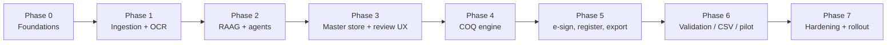

# 07 — Implementation Roadmap

A phased, dependency‑ordered plan. Each phase ends with a **demonstrable, testable** increment and
its own exit criteria. Estimates assume a small team (2 backend/AI, 1 frontend, 1 QA/validation,
fractional QC SME from Purely Plant). Adjust to your capacity; the **order** is the important part.

## 7.1 Phase map

## 7.2 Phase 0 — Foundations (weeks 1–2)

**Goal:** the skeleton runs end‑to‑end with stubs; the contracts exist.

- Repo scaffold per [README §3](../README.md); Tauri shell launches the FastAPI sidecar on `127.0.0.1`.
- PostgreSQL 16 + pgvector provisioned; apply [db/schema.sql](../db/schema.sql) via Alembic
  baseline migration; seed `coq_sequence` (2025→0032, 2026→0009), `controlled_vocabulary`
  (forbidden `EU GMP` on flower_coq; `MK GMP Certified Facility` wording; signatory roster).
- Pydantic v2 contracts in `packages/schemas`; codegen TypeScript types; CI builds all three
  targets (desktop, sidecar, schemas).
- Gateway skeleton on KVM4 with the **route map allow‑list** ([05 §5.1a]) and JSON‑Schema
  validation; health‑check the suitable agents through it.

**Exit:** `make dev` opens the app; a request round‑trips UI → sidecar → DB and UI → sidecar →
gateway → a real agent (echo classify). CI green.

## 7.3 Phase 1 — Ingestion + OCR (weeks 3–5)

**Goal:** any eCOA PDF becomes structured, provenance‑bearing chunks in the DB — no agents yet.

- Intake + SHA‑256 dedup + encrypted object store; `source_file`/`ecoa_document` rows.
- Digital‑vs‑scanned router (PyMuPDF probe); digital path (pdfplumber/PyMuPDF) with coordinates.
- OCR path: docTR + PaddleOCR (Cyrillic) + Tesseract fallback; OpenCV preprocessing.
- Table recovery (table‑transformer/img2table) with cell geometry + confidence.
- Context‑aware chunker (sections + table rows); embedder (`text-embedding-3-small`, 1536‑d);
  pgvector HNSW index.
- UI: drag‑drop ingest, PDF.js viewer with **bbox overlays**.

**Exit:** drop a real UKIM (en) and a real IJZ (Cyrillic) certificate → both produce sectioned,
embedded chunks; clicking a chunk highlights its PDF region. Golden tests on a fixture corpus.

## 7.4 Phase 2 — RAAG + agent orchestration (weeks 6–8)

**Goal:** the suitable agents extract and match through the gateway, with the learning loop.

- Gateway endpoints for `coa-ingestion/classify`, `parameter-extraction/extract`,
  `coq-assembly/match`; strict request/response schema validation + retry/circuit‑break.
- Core API pipeline state machine ([01 §1.6]); persist **staged** `ecoa_parameter` + provenance.
- Confidence gates ([04 §4.9]); escalation to gpt‑4o OCR agent; translator agent for Cyrillic.
- Memory write‑back path (correction → `lab_synonym` + agent archival passage via gateway).

**Exit:** end‑to‑end extraction on the fixture corpus; cross‑lingual match
(`TAMC` ↔ `Вкупен број…`) succeeds; a correction persists and improves the next run. Degradation
test: KVM4 down → ingestion still works, extraction queues.

## 7.5 Phase 3 — Master parameter store + review UX (weeks 9–11)

**Goal:** the single source of truth, human‑confirmed.

- Master parameter resolver ([03 §3.5]): spec ↔ evidence reconciliation across multiple labs;
  conflict + gap surfacing; `selection_reason` recorded.
- Review UI: per‑batch grid of spec requirements vs proposed evidence, confidence, source eCOA;
  confirm/correct/override; commit flips staged → confirmed.
- Lineage UI: cultivation → production → packaging browser.

**Exit:** a batch tested by 2+ labs reconciles to one confirmed master set; gaps shown as
`not_tested`; every confirmed row cites its source eCOA code + date.

## 7.6 Phase 4 — COQ engine (weeks 12–15)

**Goal:** compile a compliant COQ from the master store + an uploaded template.

- Template upload + validation (mandatory‑token contract, forbidden‑string check, sandboxed
  Jinja2); import the existing `CoQ_Template_v02_VariationF.html`.
- Compliance Guard ([06 §6.4]): completeness, gaps, source‑mapping, **forbidden `EU GMP`**,
  wording, signatory rules, verdict consistency.
- Transactional numbering allocator + register write ([06 §6.5]); WeasyPrint + Playwright render
  backends; post‑render forbidden‑string scan; PDF/A + SHA‑256 lock.

**Exit:** generate `CoQ-PP-2026-0010` from a real batch; golden‑file PDF regression; guard blocks
a template that bakes in `EU GMP` and a batch with a mandatory gap.

## 7.7 Phase 5 — e‑signature, register, export (weeks 16–17)

- Dual e‑signature ([06 §6.9]); `issued` only with both; optional PKCS#7 PDF signing.
- Certificate Issuance Register viewer + export (CSV/PDF); issuance/coding history.
- Batch **data pack** export for the EU QP (COQ PDF + cited eCOAs + provenance JSON).

**Exit:** an issued COQ is fully signed, registered, immutable, exportable; void/reissue works and
is logged.

## 7.8 Phase 6 — Validation / CSV / pilot (weeks 18–21)

- Computer System Validation pack ([08](08_SECURITY_DATA_INTEGRITY.md)): URS/FS/DS traceability
  matrix, IQ/OQ/PQ protocols, test evidence, audit‑trail review, ALCOA+ assessment.
- Staging Letta org mirrors production; agent prompt/version change control.
- **Parallel‑run pilot:** issue COQs in COQ_GEN alongside the current manual process for N real
  batches; reconcile differences with the QC SME.

**Exit:** PQ passed on real batches; QC sign‑off; SOP for the app written; discrepancies = 0 on
release‑critical fields.

## 7.9 Phase 7 — Hardening + rollout (weeks 22–24)

- Code‑signing + auto‑update; backup/restore runbook; DR test; performance pass.
- Multi‑analyst concurrency test (numbering race, simultaneous issuance).
- Training; cutover; decommission the manual transcription step.

## 7.10 Cross‑phase workstreams (run continuously)

| Workstream | Activity |
|------------|----------|
| Data integrity | Audit trail + hash chain from Phase 0; reviewed every phase |
| Security | mTLS, secrets in keychain, least‑privilege DB roles from Phase 0 |
| Test corpus | Grow a labelled fixture set of real (anonymised) eCOAs per lab/language |
| Parameter ontology | Curate `parameter_dictionary` + seed `lab_synonym` for UKIM/IJZ |
| Documentation | Keep this design set + SOPs in lock‑step with code |

## 7.11 Top risks & mitigations

| Risk | Impact | Mitigation |
|------|--------|------------|
| OCR/table errors on poor scans | wrong results on a certificate | confidence gates + human confirm + bbox provenance + gpt‑4o escalation; nothing auto‑commits |
| Agent hallucination / drift | bad match reaches a COQ | gateway schema validation; agents never write release tables; master store is human‑confirmed; golden tests |
| Forbidden `EU GMP` slips onto a flower COQ | compliance breach | dual guard (pre‑number data scan + post‑render output scan) + audited owner override |
| Numbering gap/duplicate | register integrity breach | transactional `FOR UPDATE` allocator; DB is the authority, agent number is advisory |
| KVM4 outage | pipeline stalls | local‑first degradation to manual assist; queued write‑back |
| Template injects unsafe content | security | sandboxed Jinja2, no fs/network, autoescape, upload validation |
| Regulatory wording changes | rework | rules in `controlled_vocabulary`/`app_config`, not code |
| Scope creep into LIMS/ERP | timeline | scope fence in [00 §0.2]; integrate only batch identifiers |

## 7.12 Definition of done (product)

A QC analyst ingests multi‑lab, multilingual eCOAs for a batch; reviews and confirms a fully
source‑mapped master parameter set; generates a Variation F COQ that passes every compliance
guard; the system assigns the correct monotonic `CoQ-PP-YYYY-NNNN`, writes the register, captures
dual e‑signatures, locks the PDF, and exports a QP‑ready data pack — all within the controlled,
validated, fully audited boundary.
