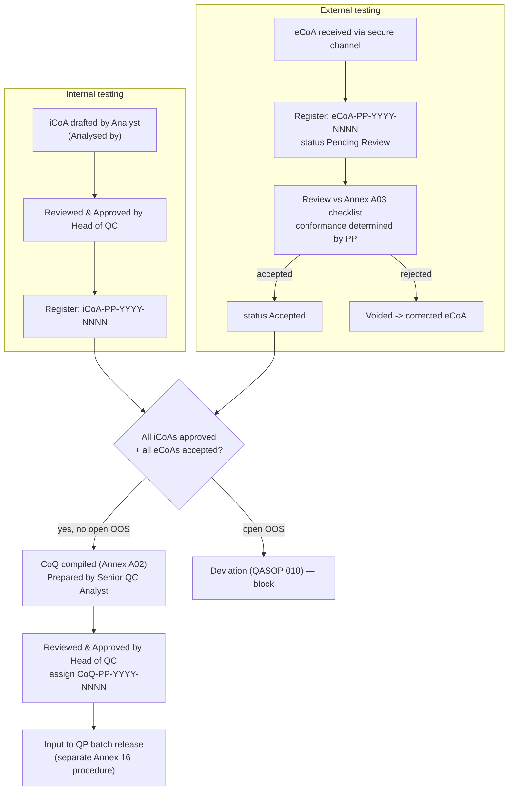

# 09 — SOP Alignment & Traceability

This document traces the design to the two governing SOPs supplied by the owner:

- **QCSOP 010** — *SOP for Specifications* (development, content, coding §6.6, revision, Master
  Specification Register).
- **QCSOP 012 v3** — *SOP for Certificate of Analysis & Certificate of Quality — Issuance and
  Management* (iCoA / eCoA / CoQ lifecycle, numbering, register, signatories, OOS, retention).

Rules previously inferred from agent memory are now anchored to the SOP clauses. Where the SOP
**corrected** an earlier assumption, the change made to the design is listed.

## 9.1 Headline corrections the SOPs forced

| # | What changed | Source clause | Where fixed |
|---|--------------|---------------|-------------|
| C1 | **The CoQ is NOT an EU‑GMP Annex 16 batch‑release certificate.** It is a QC‑internal aggregation of all iCoA + eCoA results vs the spec, used as **one input** to the QP's separate release decision. | QCSOP 012 v3 §3 (definitions): *"The CoQ is not itself a batch release certificate as defined by EU GMP Annex 16 … not defined by EU GMP."* | docs 00/06/08 reworded; "EU‑GMP‑compliant COQ" → "complete spec‑conformance input for QP release" |
| C2 | **Three certificate types, not one.** The CoQ consolidates **internal iCoA** and **external eCoA** results — the system must ingest internal CoAs too, not only external. | QCSOP 012 v3 §3, §6.4 | `ecoa_document.cert_type` (iCoA\|eCoA) + `origin`; master store accepts both |
| C3 | **Numbering is per certificate type, per calendar year**, strictly monotonic; gaps are ALCOA+ data‑integrity events. | QCSOP 012 v3 §6.9.1 | `coq_sequence` → `cert_sequence(cert_type, year)`; smoke T1/T1b |
| C4 | **The register tracks iCoA, eCoA and CoQ** (eCoA gets `eCoA-PP-YYYY-NNNN` + a register row on receipt, status Pending Review→Accepted). | QCSOP 012 v3 §6.3.2, §6.9 | `register_entry` generalised (nullable `coq_id` + `ecoa_document_id`, `UNIQUE(cert_type,year,seq_no)`) |
| C5 | **Issuing a CoQ for a batch with an open OOS is a reportable deviation** (QASOP 010). | QCSOP 012 v3 §6.6, §6.11 | Compliance Guard rule added (docs 06 §6.4) |
| C6 | **Specs are strain‑agnostic (owner policy).** QCSOP 010 §6.6 *allows* per‑strain spec numbers, but the owner has decided **not to recognise strains**: `QCSP-IMB-001`/`QCSP-FP-001` apply to all products; classification is by **cannabinoid dominance (THC/CBD) + grade tier**. Strain is descriptive only and is printed on the CoQ. | QCSOP 010 §6.6 + owner ruling | `product_spec.dominance` (strain column removed); `production_batch.dominance/grade`; strain stays on `cultivation_batch` |
| C7 | **Master Specification Register** with Active/Superseded/Withdrawn lifecycle. | QCSOP 010 §6.10 | `product_spec.status` |

## 9.2 What the SOPs CONFIRMED (design already correct)

| Design feature | Confirming clause |
|----------------|-------------------|
| Per‑parameter source mapping: param, acceptance, result, units, **testing lab (internal/external)**, **source cert ref + issue date**, conformance | QCSOP 012 v3 §6.4.1 (CoQ aggregated results table + source certificate list) |
| **Conformance determined by Purely Plant, not copied from the eCoA** | QCSOP 012 v3 §6.3.2: *"The conformance determination shall be made by Purely Plant, not taken from the eCoA."* |
| Transactional, monotonic numbering allocated at **final approval** (DB authoritative, not agent memory) | QCSOP 012 v3 §5 (Head of QC "assigns final certificate numbers on final approval") + §6.9.1 |
| **Two CoQ sign‑offs, no Qualified Person as signatory** (Prepared by Senior QC Analyst/Head of Lab; Reviewed & Approved by Head of QC) | QCSOP 012 v3 §5, §6.4.3 |
| eCoAs retained in **original language**; working translations don't replace originals | QCSOP 012 v3 §6.7 |
| OOS certificates carry explicit "Out of Specification — [parameter(s)]" + highlight | QCSOP 012 v3 §6.6 |
| Spec categories **IMG / IPM / FP / IMB**; code `QCSP-[CAT]-[NNN] v.[VV]` | QCSOP 010 §6.6 |
| Controlled storage, role‑based access, audit trail (Annex 11 §9), retention, change control | QCSOP 012 v3 §5.x; QCSOP 010 §6.10 |

## 9.3 Certificate lifecycle (as governed by QCSOP 012 v3)

## 9.4 The EU‑GMP vs MK‑GMP wording — RESOLVED (owner ruling)

The supplied **product specifications** (QCSP‑IMB‑001 v.01, QCSP‑FP‑001 v.01, both 26 May 2026)
print **"EU GMP Certified Facility"** in the footer (manufacturer *Purely Plant DOOEL, Petrovec,
N. Macedonia*). The `VariationF` agent's locked rule (set 5 Jun 2026, i.e. *after* these specs)
says flower CoQ/CoA/**Spec** must print **"MK GMP Certified Facility"** and **flag any "EU GMP"
string for owner confirmation**.

**Owner ruling (confirmed): "MK GMP" is authoritative.** Flower CoQ/CoA/Spec documents must print
**"MK GMP Certified Facility" (MALMED, North Macedonia)** and the Compliance Guard **hard‑blocks**
the literal string `EU GMP` on flower documents (audited owner override only). The two uploaded
specs' footers are treated as the error this rule corrects and should be re‑issued under change
control. This ruling is encoded as data in `controlled_vocabulary`
(`forbidden_string`/`gmp_wording` rows seeded in `db/schema.sql`) and verified by smoke test **T6**,
so the policy is enforced by configuration, not code.

## 9.5 Open items to confirm with QC

1. **GMP facility wording** (EU vs MK) — §9.4.
2. **iCoA/eCoA seed counters** — current per‑type, per‑year sequence values for 2025/2026 (CoQ is
   known: 2025→0032, 2026→0009; iCoA/eCoA counters needed to seed `cert_sequence`).
3. **Spec applicability** — RESOLVED (owner ruling): `QCSP-IMB-001`/`QCSP-FP-001` are
   **strain‑agnostic** and apply to all products; classification is by **dominance + grade**, not
   strain. The CoQ references the product spec as the conformance basis **and additionally states
   the strain** as descriptive plant information. Recommend documenting this classification policy
   in QCSOP 010 at next revision (it narrows the §6.6 per‑strain option).
4. **Active spec version** — the agent referenced `QCSP-IMB-001 v02`; the supplied document is
   `v.01` (26 May 2026, superseding legacy `PP-QC-SPEC-IB-001 v02`). Confirm the authoritative version.
5. **Annex A02/A03/A05 templates** — obtain the controlled CoQ/checklist/register templates to
   bind the renderer and the upload‑validation token set exactly.

## 9.7 iCoA vs eCoA, template management & test ownership (owner rulings)

Confirmed by the owner; encoded in the schema/seed/endpoints:

- **eCoA = outsourced.** Issued by contracted accredited labs; **format/layout differ per lab and
  are entirely outside our control** (heterogeneous, multilingual, scanned or digital). The eCoA
  path makes **no template assumptions** — OCR + visual understanding + agentic (RAAG) extraction +
  per‑lab synonym learning + human review; original file preserved in its original language; an
  internal cross‑ref `eCoA-PP-YYYY-NNNN` is assigned on receipt; conformance is re‑determined by
  Purely Plant. eCoAs are **read, never formatted by us**.
- **iCoA = internal, app‑generated.** An Annex produced from the CoA/CoQ SOP, rendered by the app
  from a **controlled template** (final HTML to be supplied by owner). Numbered
  `iCoA-PP-YYYY-NNNN` (per QCSOP 012). It is referenced as a source certificate in the batch's CoQ.
- **Template management (first‑class feature).** *All* documents the app generates (iCoA, CoQ, CoA,
  Spec) use the versioned `document_template` store: upload a new `.html` version → it supersedes
  the prior active template for that `doc_type`; **future** documents render with the active
  version, while **issued** documents keep the exact version they were rendered with. Endpoints:
  `GET /templates`, `GET /templates/{doc_type}`, `POST /templates` (upload + auto‑supersede).
  (Per‑doc_type mandatory‑token validation, docs/06 §6.7, is applied once each contract is final.)
- **Test ownership** (`parameter_dictionary.default_source`):
  - **internal → iCoA:** Appearance; Identification (macroscopic mon. 3028 / microscopic 2.8.23 /
    HPLC 2.2.29–2.2.25); Foreign Matter (2.8.2).
  - **external → eCoA:** assays (THC/CBD/CBN), Loss on Drying, microbiology, aflatoxins, heavy
    metals, pesticides.
  - **not_performed (capability gap):** HPTLC Identification Test C (THC+CBD zones, Ph. Eur.
    2.8.25 / HPTLC C18) — **not done in‑house**; never expected or issued internally.
